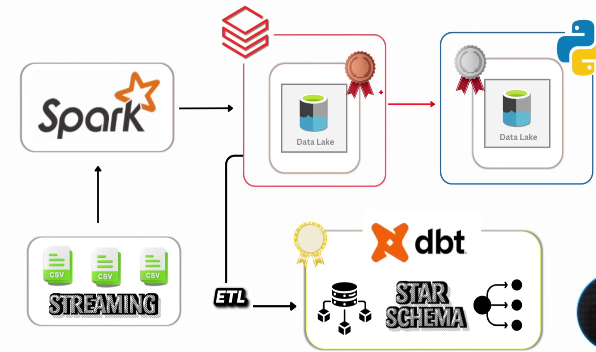
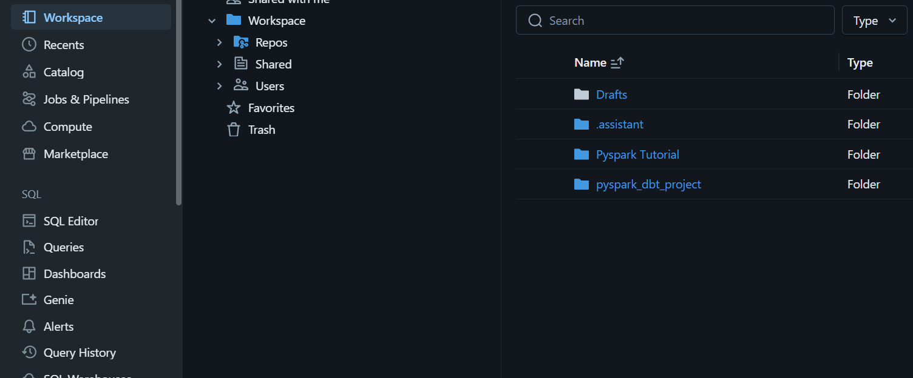
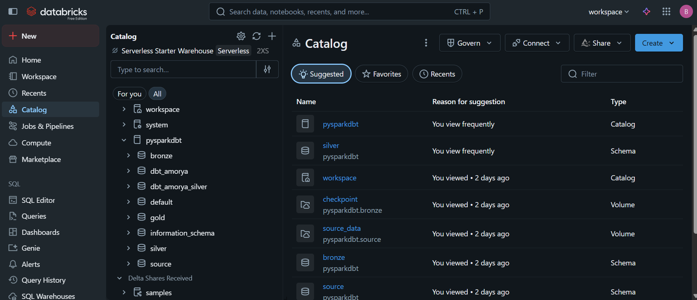
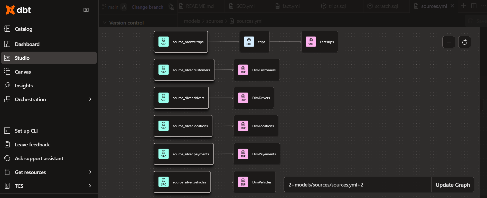

# 🚖 Ride-Sharing Medallion Data Engineering Project
**An End-to-End Data Engineering Pipeline using Databricks & dbt Cloud**

---

## 📖 Project Overview
This project implements a scalable **Medallion Architecture** (Bronze, Silver, Gold) to process ride-sharing data (Customers, Drivers, Trips, Payments, and Vehicles). The goal was to bridge the gap between raw, messy CSV data and high-integrity, historized business intelligence.


### 🏗️ Architecture Workflow
The pipeline automates the flow of data from ingestion to a "Gold" standard catalog using a mix of Spark Structured Streaming and dbt's modeling power.

 


---

## 🛠️ Tech Stack
* **Compute:** Databricks (Community Edition), PySpark
* **Transformation & Historization:** dbt Cloud (Managed Layer)
* **Storage & Governance:** Unity Catalog, Delta Lake
* **Version Control:** GitHub
* **Language:** Python (OOPS), SQL, Jinja

---

## 🚀 Key Engineering Features

### 📥 1. Bronze Layer: Dynamic Streaming Ingestion
Instead of static scripts, I built a **Metadata-Driven Ingestion** loop.
* **Logic:** Uses `spark.readStream` with `trigger(once=True)` to combine streaming reliability with batch cost-efficiency.
* **Resilience:** Implemented `checkpointLocation` and manual schema application to prevent pipeline breaks on source data changes.


### 💎 2. Silver Layer: Object-Oriented Transformation Framework
I developed a **custom Python Class** (`transformation`) to standardize data cleaning across all entities.
* **Deduplication:** Utilized Window Functions (`row_number`) to ensure only the latest record is kept based on `last_updated_timestamp`.
* **Dynamic Upserts:** Built an automated **Delta Lake Merge** function that handles inserts and updates dynamically based on primary keys.


### 🏆 3. Gold Layer: dbt Historization (SCD Type 2)
Using dbt Cloud, I transformed the Silver tables into a reporting-ready Star Schema.
* **SCD Type 2 Snapshots:** Implemented `timestamp` strategy snapshots to track historical changes (e.g., a driver changing their vehicle or a customer updating their profile).
* **Incremental Modeling:** The `FactTrips` model uses incremental materialization to process only new data, significantly reducing compute costs.


---

## 📂 Repository Structure
```text
├── Databricks/                  # PySpark Notebooks
│   ├── bronze_ingestion.py      # Dynamic streaming loop
│   ├── silver_transformation.py # OOPS Class for cleaning/upserts
├── dbt_Flies/                   # dbt Cloud Implementation
│   ├── models/                  # Incremental SQL models (trips.sql)
│   ├── snapshots/               # SCD Type 2 YAML (Customers, Drivers)
│   ├── macros/                  # Custom schema logic
│   └── dbt_project.yml          # Project configuration
├── Project_Screenshot/          # Technical documentation images
├── Raw_Files/                   # Source files for the project
└── README.md
